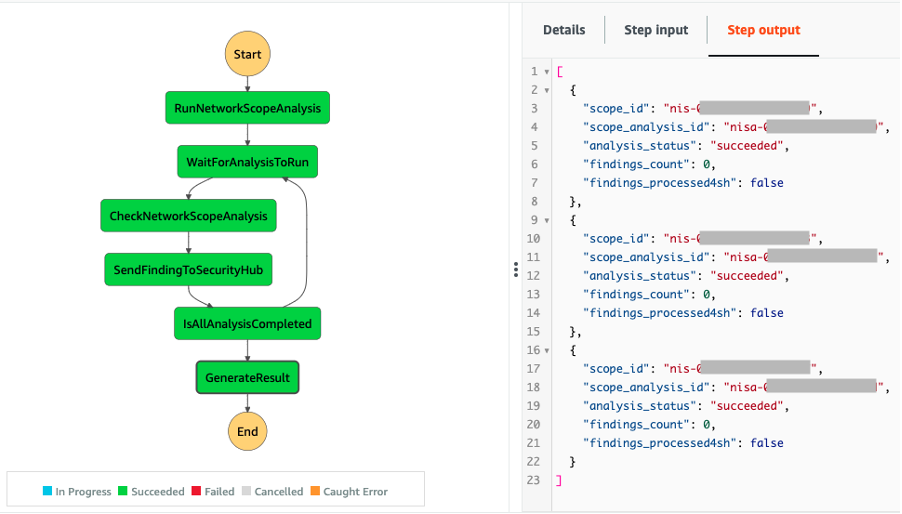
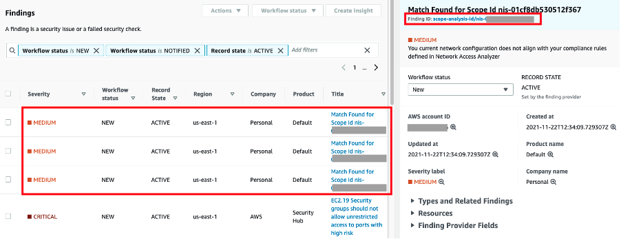

# VPC Network Access Analyzer Automation

This project contains source code and supporting files that you can use to schedule Network Access Scope Analysis and send the result of the findings to AWS Security Hub.

In re:Invent 2021, AWS announced the VPC Network Access Analyzer. A new tool that uses Network Access Scopes to specify the desired connectivity between your AWS resources. You can analyze a initiate analysis of a given scope to generate a set of findings, each of which indicates an unexpected network path between the AWS resources defined in the scope. For more details see the launch [blog post](https://aws.amazon.com/blogs/aws/new-amazon-vpc-network-access-analyzer/).

This project was developed to give customers guidance on how to run Network Access Scope Analysis at regular intervals (say every 12 hours) and send the findings to AWS Security Hub. This will help setup a continous monitoring of your network setup and customers can further setup auto remediation to resolve any findings. For a detailed guide on how the tool can be deployed and used with a sample infrastructure, refer to the [blog post](https://aws.amazon.com/blogs/networking-and-content-delivery/continuous-verification-of-network-compliance-using-amazon-vpc-network-access-analyzer-and-aws-security-hub/).

The diagram below shows the high level architecture of the solutions. 

<p align="center">
  
</p>

The step function runs at the defined interval and during the execution, the following steps are carried out:

1. Initiates network scope analysis for all the network scopes defined within Network Access Analyzer in the target AWS Region.

2. Checks if all the analyses are complete (with a default 30 second wait between network scope analyses).

3. Sends findings to Security Hub for the analysis that are complete.

4. If the analyses are not complete, the execution returns to Step 2, otherwise the analysis result is formatted as an output of the step function.

## How to deploy the solution

The VPC Network Access Analyzer Automation solution is a SAM application with the lambda functions developed in Python. To deploy the SAM application you can use AWS CloudShell (which comes with AWS CLI, SAM CLI and Python pre-installed). You can also use any other CLI tool in which case you will need to install SAM CLI following the [instructions](https://docs.aws.amazon.com/serverless-application-model/latest/developerguide/serverless-sam-cli-install.html).


Clone the respository and deploy the VPC Network Access Analyzer Automation solution in your AWS account using the commands below:

```bash
sam build
sam deploy --guided --capabilities CAPABILITY_NAMED_IAM
```

The “sam deploy —guided —capabilities CAPABILITY_NAMED_IAM“ command asks you to specify a few parameters. You can select the defaults by pressing “Enter” at each prompt.

Once we have deployed the SAM application, a schedule rule is created in Amazon EventBridge that triggers the step function at the set interval. The step function consists of three tasks:

RunNetworkScopeAnalysis – a lambda function that identifies all the network scopes created in the corresponding Region and initiates a network scope analysis for each.
CheckNetworkScopeAnalysis – a lambda function that checks the status of the network scope analysis to identify if the analysis is still in a “running” state.
SendFindingToSecurityHub – a lambda function that aggregates the findings across the network scope analysis and sends the findings to AWS Security Hub.

## Outputs from the VPC Network Access Analyzer Automation solutions

The diagram below shows an output from the VPC Network Access Analyzer Automation solution. 

<p align="center">
  
</p>

It provides the following details: 
1. scope_id: The Network Access Scope Id
2. scope_analysis_id: The Network Access Scope Analysis Id
3. analysis_status: The status of the Network Access Scope Analysis. 
4. findings_count: The number of findings generated by the Network Access Scope Analysis.
5. findings_processed4sh: If 'true' indicates that the findings have been sent to security hub and if 'false' indicates that no findings was generated.

The diagram below shows findings sent to the AWS Security Hub.

<p align="center">
  
</p>

## Security

See [CONTRIBUTING](CONTRIBUTING.md#security-issue-notifications) for more information.

## License

This library is licensed under the MIT-0 License. See the LICENSE file.
Testing

