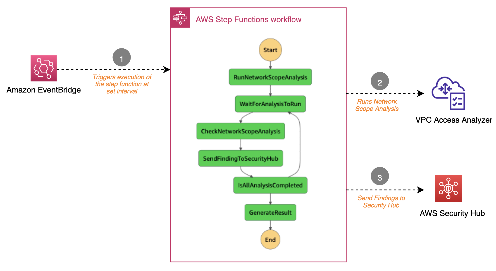

# VPC Network Access Analyzer Automation

This project contains source code and supporting files that you can use to schedule Network Access Scope Analysis and send the result of the findings to AWS Security Hub.

In re:Invent 2021, AWS announced the VPC Network Access Analyzer. A new tool that uses Network Access Scopes to specify the desired connectivity between your AWS resources. You can analyze a initiate analysis of a given scope to generate a set of findings, each of which indicates an unexpected network path between the AWS resources defined in the scope. For more details see the launch [blog post](https://aws.amazon.com/blogs/aws/new-amazon-vpc-network-access-analyzer/).

This project was developed to give customers guidance on how to run Network Access Scope Analysis at regular intervals (say every 12 hours) and send the findings to AWS Security Hub. This will help setup a continous monitoring of your network setup and customers can further setup auto remediation to resolve any findings. For a detailed guide on how the tool can be deployed and used with a sample infrastructure, refer to the [blog post](https://aws.amazon.com/blogs/networking-and-content-delivery/continuous-verification-of-network-compliance-using-amazon-vpc-network-access-analyzer-and-aws-security-hub/).

The diagram below shows the high level architecture of the solutions. 

  

The step function runs at the defined interval and during the execution, the following steps are carried out:

1. Initiates network scope analysis for all the network scopes defined within Network Access Analyzer in the target AWS Region.

2. Checks if all the analyses are complete (with a default 30 second wait between network scope analyses).

3. Sends findings to Security Hub for the analysis that are complete.

4. If the analyses are not complete, the execution returns to Step 2, otherwise the analysis result is formatted as an output of the step function.

